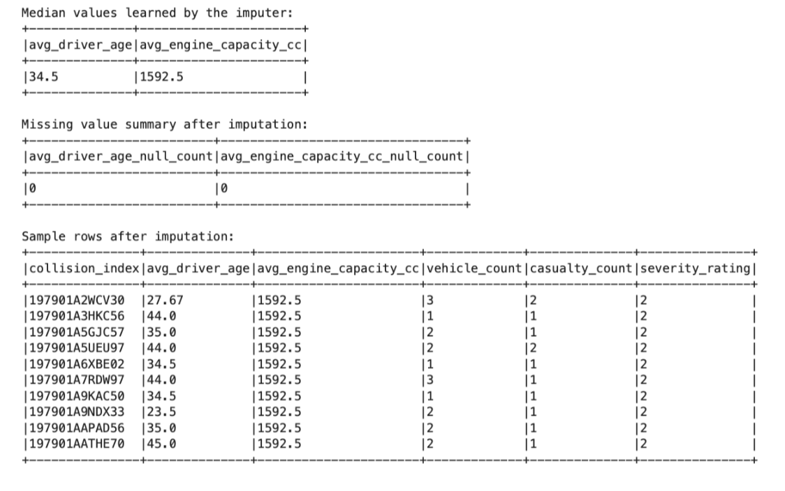
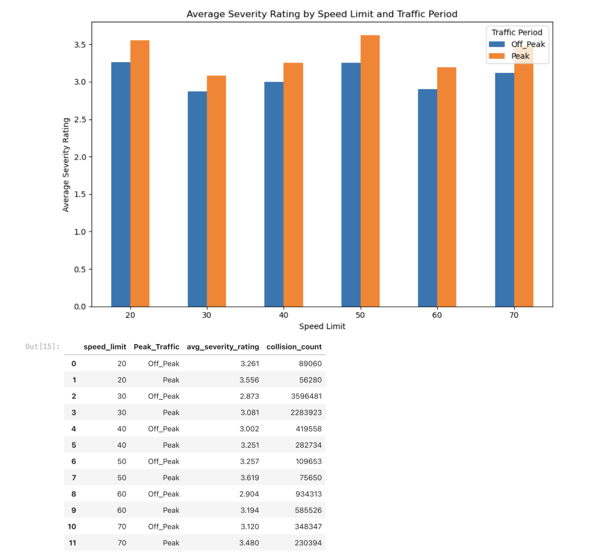
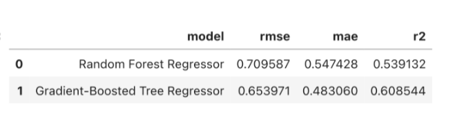

# 🚗 Road Accident Severity Prediction with PySpark

This repository contains my PySpark machine learning project for predicting road accident severity using large-scale traffic data. The project combines **data loading**, **feature engineering**, **missing-value imputation**, **exploratory analysis**, **regression modelling**, and **model optimisation** to build and evaluate predictive models for accident severity.

---

## 📌 Introduction

This project focuses on predicting road accident severity in a distributed computing environment using **PySpark**.

Using large-scale road accident data, I built a machine learning workflow that prepares structured features, handles missing values, explores relationships between traffic conditions and severity, and trains regression models to predict accident severity ratings.

The project demonstrates practical skills in:

- PySpark data processing
- feature engineering
- missing-value imputation
- exploratory analysis
- regression modelling
- model comparison
- hyperparameter tuning
- large-scale machine learning

---

## 💡 Motivation

Road accident severity is influenced by many factors, including traffic conditions, vehicle characteristics, and environmental context. Predicting severity can help support road safety analysis, policy planning, and risk assessment.

The goal of this project is to show how **PySpark ML** can be used to build scalable predictive models on large road accident datasets, while also identifying which traffic and vehicle-related variables are most useful for severity prediction.

---

## 📂 Dataset Description

This project works with large-scale road accident data and derived modelling features.

The modelling process uses variables related to:

- driver information
- vehicle engine capacity
- vehicle count
- casualty count
- speed limit
- traffic period
- accident severity rating

The notebook prepares these features for regression-based prediction and model evaluation.

---

## 🧹 Data Preparation and Feature Engineering

Before modelling, the project performs several preprocessing steps to prepare the dataset for machine learning.

Main tasks include:

- loading data into **PySpark DataFrames**
- selecting relevant modelling variables
- handling missing values using imputation
- preparing numerical features for model input
- structuring training and testing datasets
- creating traffic-related derived features such as **Peak** and **Off_Peak**

The notebook also applies median imputation to variables such as `avg_driver_age` and `avg_engine_capacity_cc`. After imputation, the missing-value counts for these fields were reduced to zero. The learned medians shown in the notebook were **34.5** for average driver age and **1592.5** for average engine capacity. :contentReference[oaicite:1]{index=1}

---

## 📊 Key Visualisations

### 1. Missing-Value Imputation Summary



This output shows the median values learned by the imputer and confirms that missing values in important numerical features were successfully filled. It also includes a sample of rows after imputation, showing the prepared inputs used for later modelling.

### 2. Average Severity Rating by Speed Limit and Traffic Period



This chart compares average severity ratings across speed limits for **Peak** and **Off_Peak** traffic periods. Across all displayed speed limits, peak traffic has a higher average severity rating than off-peak traffic. The highest severity values appear at higher speed limits, especially around **50** and **70**, suggesting that both traffic period and speed environment may influence accident severity.

### 3. Model Performance Comparison



This table compares the two regression models used in the project:

- **Random Forest Regressor**
- **Gradient-Boosted Tree Regressor**

The **Gradient-Boosted Tree Regressor** performed better, achieving lower **RMSE** and **MAE**, and higher **R²** than the Random Forest model. The notebook reports:
- Random Forest Regressor: RMSE **0.7096**, MAE **0.5474**, R² **0.5391**
- Gradient-Boosted Tree Regressor: RMSE **0.6540**, MAE **0.4831**, R² **0.6085** :contentReference[oaicite:2]{index=2}

---

## 🤖 Models Used

The project builds and compares two regression models:

- **Random Forest Regressor**
- **Gradient-Boosted Tree Regressor**

The models were evaluated using:

- **RMSE**
- **MAE**
- **R²**

The **Gradient-Boosted Tree Regressor** was selected as the better-performing model and saved as the best baseline model for later use. :contentReference[oaicite:3]{index=3}

---

## ⚙️ Hyperparameter Tuning

After selecting the better baseline model, the project performs hyperparameter tuning on the **Gradient-Boosted Tree Regressor** using **TrainValidationSplit** and **ParamGridBuilder**. The tuned parameters included:

- `maxDepth`
- `maxIter`
- `stepSize`

The best tuned configuration tested was:
- `maxDepth = 5`
- `maxIter = 30`
- `stepSize = 0.1`

However, the tuned model did **not** improve on the baseline. The tuned GBT model achieved RMSE **0.6565**, MAE **0.4855**, and R² **0.6056**, which was slightly worse than the original Part 2 GBT model. As a result, the original **Gradient-Boosted Tree Regressor** remained the final saved model. 

---

## 🧪 Tools and Technologies Used

This project was built using:

- **Python**
- **PySpark**
- **PySpark MLlib**
- **Pandas**
- **Matplotlib**
- **Jupyter Notebook**

Main PySpark ML concepts used include:

- `SparkSession`
- `StructType` / schema configuration
- imputation
- feature preparation pipelines
- `RandomForestRegressor`
- `GBTRegressor`
- `TrainValidationSplit`
- `ParamGridBuilder`
- regression evaluation metrics

The notebook configures Spark with explicit memory, partition, adaptive execution, and serializer settings for large-scale processing. :contentReference[oaicite:5]{index=5}

---

## 📈 Project Highlights

- Built a full **PySpark ML pipeline** for accident severity prediction
- Performed **median imputation** for missing numerical features
- Created derived traffic features such as **Peak** and **Off_Peak**
- Explored how speed limit and traffic period relate to severity
- Trained and compared **Random Forest** and **Gradient-Boosted Tree** regressors
- Evaluated models using **RMSE**, **MAE**, and **R²**
- Applied **hyperparameter tuning** using `TrainValidationSplit`
- Selected and saved the best-performing severity prediction model 

---

## 📁 Files

- `A2A_mngo0011.ipynb` — Jupyter notebook containing the full PySpark modelling workflow
- `Screenshot 2026-07-17 at 11.31.04 pm.png` — imputation summary and sample rows
- `Screenshot 2026-07-17 at 11.31.42 pm.png` — severity rating by speed limit and traffic period
- `Screenshot 2026-07-17 at 11.32.21 pm.png` — regression model comparison
- `README.md` — project summary and usage instructions

---

## ▶️ How to Run the Project

1. Open the notebook in **Jupyter Notebook**, **JupyterLab**, or **VS Code**
2. Make sure the required road accident dataset files are stored in the correct working directory
3. Install the required libraries if needed:

```bash
pip install pyspark pandas matplotlib
